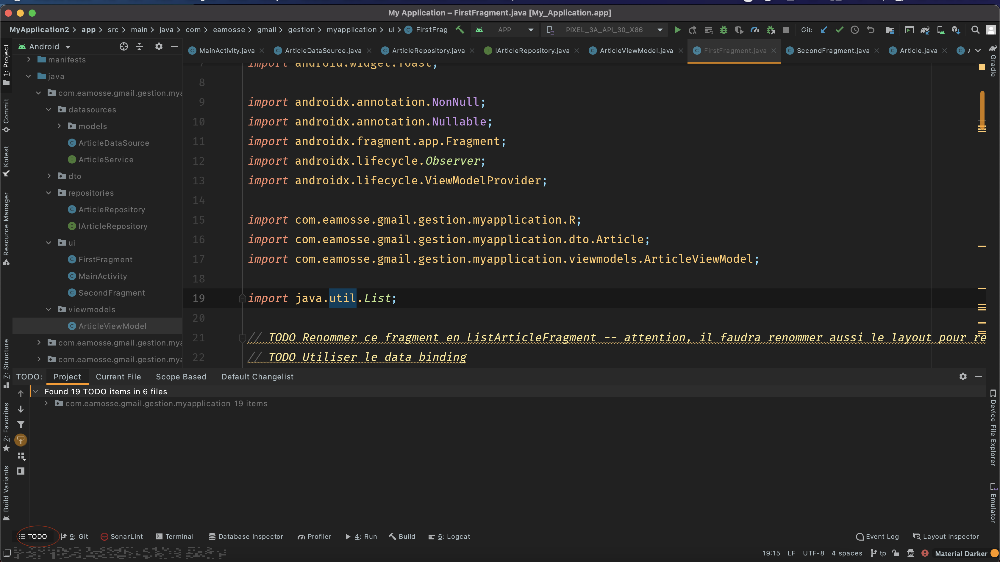
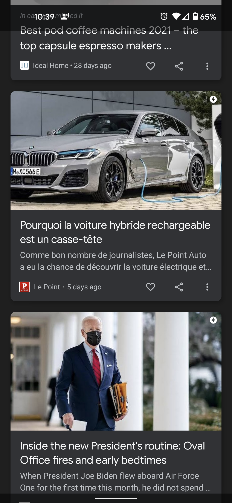

# TP News Letter
Compléter ce projet en résolvant la liste des TODO dans les différentes classes du projet

## Fork le projet 
Avant toutes choses, forker le projet dans votre espace

## Comment idenfier facilement les TODO sur Android Studio ? 

## Affichage de la liste d'articles

